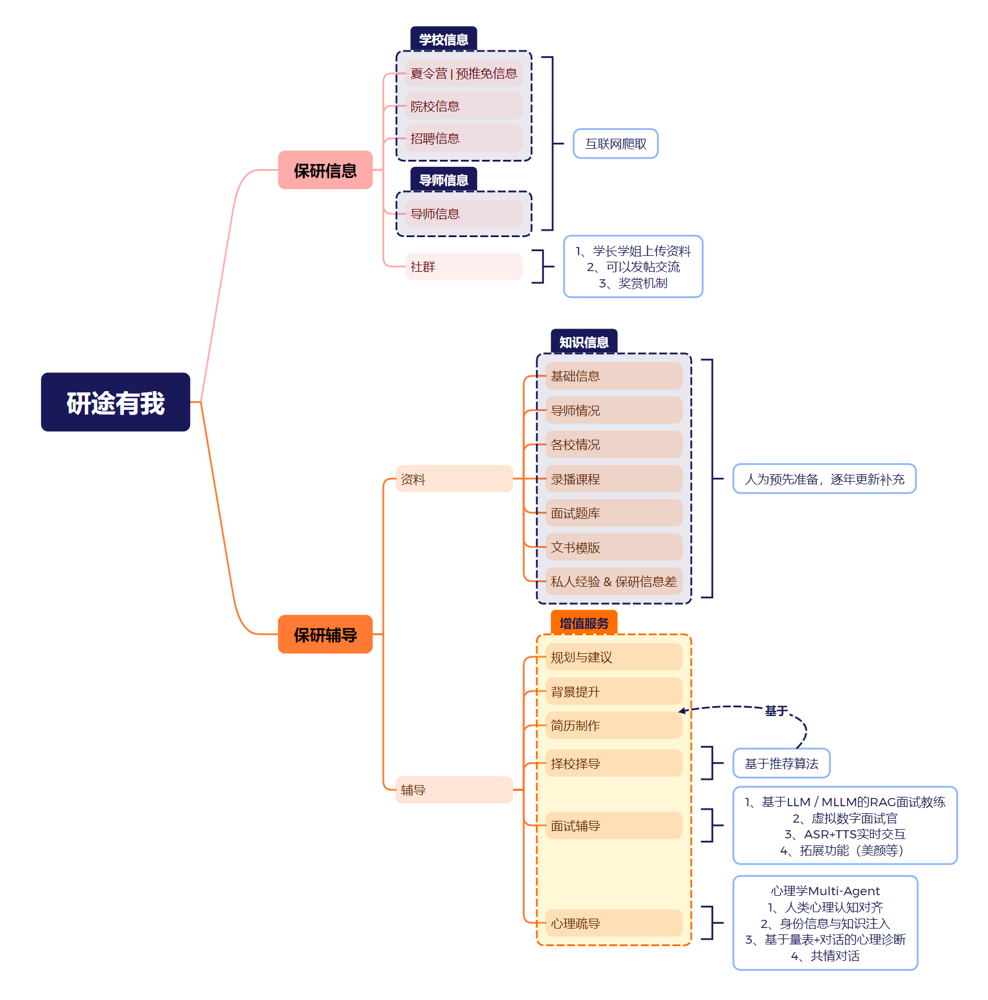

# 研途有我 —— 项目构想文档

> 「研途有我」是一个由我独立构思的小规模实验性创业项目，代表了我在教育领域的一次初步尝试。本文档旨在梳理项目的核心理念、目标用户、功能规划与技术方案，为后续开发提供指导。

---

## 一、目标用户

本项目面向学生群体中的两类核心人群：

### 1.1 即将保研的大三/大四高 GPA 学生

- **画像**：即将从大三升入大四，GPA 较高，准备申请推荐免试研究生（推免/保研）资格。
- **特点**：消费能力和意愿较强，需求明确。
- **核心需求**：一款能提供推免流程相关的**一站式信息聚合**与**个性化指导**的产品。

### 1.2 大一至大三有保研意向的"未定型"学生

- **画像**：刚进入校园心存迷茫，不知如何规划学业路径；或在保研分数线边缘徘徊，缺少关键信息与机遇。
- **核心需求**：**方向规划与信息指导**——通过获取更全面的信息和专业建议，细致规划学习生活，提升保研竞争力。

> 💡 我们的产品专为满足上述用户群体的需求而设计，能够为大多数符合条件的用户提供切实帮助。

---

## 二、需求与功能概览

下方思维导图概述了产品所提供的各项服务及部分技术实现方式：



我们的服务可以从两个维度进行分类：

| 维度       | 分类                         |
| ---------- | ---------------------------- |
| **内容范畴** | 保研信息、保研辅导             |
| **服务类型** | 信息服务（免费/基础）、增值服务（付费/高级） |

所有服务均与市场痛点一一对应。

---

## 三、保研信息板块

### 3.1 信息聚合

主要涵盖以下四类信息的自动化采集与展示：

| 信息类型         | 说明                                       |
| ---------------- | ------------------------------------------ |
| 夏令营 / 预推免信息 | 各高校学院发布的推免招生通知                   |
| 院校信息         | 高校及学院的基本情况、录取数据等               |
| 招生信息         | 招生名额、专业方向、报名要求等                 |
| 导师信息         | 导师研究方向、招生偏好、联系方式等             |

**解决的痛点**：
- 许多用户信息检索能力有限，常常错过重要更新；
- 部分用户因焦虑产生拖延习惯，忽略关键信息；
- 信息分散在各高校官网，缺乏统一入口。

**我们的价值**：通过自动化爬虫脚本抓取互联网公开数据，让用户快速、便捷地获取所需信息，减少时间投入，确保信息覆盖的全面性。

### 3.2 社群与内容平台

我们希望构建一个学生社群平台，提供以下功能：

- **沟通交流**：不同专业、不同地域的学生在线互动
- **学习打卡**：记录每日论文阅读、背单词、刷题等学习进度
- **问答社区**：针对保研相关问题进行提问与回答
- **内容推荐**：基于推荐算法发布保研相关帖子与资讯

> 🎯 **愿景**：将社群孵化为大学生信息交流的重要工具，促进同辈交流，拓宽信息获取途径。

---

## 四、保研辅导板块

### 4.1 资料库

提供一系列与推免流程相关的精选资源：

- 必备知识梳理与题库
- 帮助用户建立坚实基础，有效应对申请各阶段
- 由人工维护，**每年更新一次**，确保信息时效性

### 4.2 AI 辅导服务

辅导服务主要依托 AI 技术实现，包含以下核心功能：

#### 4.2.1 简历制作与择校推荐

| 功能       | 说明                                                   |
| ---------- | ------------------------------------------------------ |
| 简历生成   | 收集用户数据字段，自动生成结构化简历                       |
| AI 简历优化 | 利用 LLM 对简历内容进行润色与优化                         |
| 择校择导推荐 | 基于推荐算法，一对一为学生推荐适合申请的学校和导师           |

#### 4.2.2 AI 模拟面试

- **后端**：基于相关知识库实现 RAG（检索增强生成）的大语言模型
- **前端**：生成数字人进行实时交互，模拟面对面面试场景
- **语音交互**：集成 ASR（语音识别）和 TTS（语音合成），实现语音面试
- **目标**：还原线下面试的真实感与对话体验

#### 4.2.3 心理支持

- 构建专门的 AI Agent，帮助学生缓解保研过程中的焦虑与压力
- 提供情绪疏导与心理陪伴

#### 4.2.4 综合规划与建议

基于以上收集的信息，对学生情况进行综合分析，给出：
- 个性化规划与建议
- 背景提升的思路与方案

---

## 五、AI 关键技术栈

```
AI 技术模块
├── 简历模块
│   ├── 推荐算法（择校择导）
│   └── LLM 简历优化
├── 面试模块 → 个人知识库
│   ├── LLM 问答 + RAG
│   ├── ASR（语音识别）
│   ├── TTS（语音合成）
│   └── 数字人生成
└── 心理支持模块
    └── AI Agent
```

---

## 六、技术架构

### 6.1 前端

- **产品形态**：Web 应用程序（后续可扩展为小程序）
- **保研信息部分**：参考现有研究生信息门户（如"保研信息网"）的导航布局、UI 元素和交互逻辑
- **保研辅导部分**：需要全新的交互设计与开发

### 6.2 后端

| 组件类型               | 部署方案                                                     |
| ---------------------- | ------------------------------------------------------------ |
| 人工维护的信息与数据     | 存储在云服务器，或配置挂载云驱动器的本地设备                     |
| 深度学习 / AI 组件      | **方案 A**：部署在配备高显存 GPU 的服务器上（需大量计算资源）<br>**方案 B**：调用第三方 API 平台（如 SiliconFlow）的模型服务（按 Token 付费） |

---

## 七、开发计划

### Phase 1：交互设计与前端开发

- 完成前端网页 / 小程序的 UI/UX 设计
- 要求：界面美观、交互流畅、用户体验优秀

### Phase 2：爬虫系统开发

#### 目标

构建一个**全自动化的高校推免招生信息聚合系统**，能够：
1. 自动发现并爬取中国高校各学院官网发布的推免相关通知（夏令营、预推免等）
2. 利用 LLM 提取关键信息
3. 将信息结构化存储

#### 前置知识

- 博士只能通过申请获得（不可考试）
- 硕士既可以申请也可以考试
- 信息发布渠道：学校信息页、学院信息页、学校研招网、微信公众号

#### 实现思路

整体分为三个阶段，目标是**最大程度减少人工参与**：

| 阶段 | 任务                                                         | 工具/方法                        |
| ---- | ------------------------------------------------------------ | -------------------------------- |
| **1** | 初步获取每所高校各学院的官网 URL 与名称（聚焦 985/211 高校全部学院） | AI 浏览器 / AI Studio            |
| **2** | 对每所高校学院官网，定位其信息发布页的 URL                       | 自动化脚本 + 规则匹配            |
| **3** | 对所有信息发布页 URL，通过规则筛选出与推免高度相关的条目，模拟点击进入，使用 LLM 阅读确认并提取结构化字段 | 爬虫 + 规则过滤 + LLM 信息提取   |

---

## 八、待讨论事项

> 以下问题需要在开发前进一步明确：

- [ ] 产品的商业模式与定价策略（免费 + 增值？订阅制？）
- [ ] MVP（最小可行产品）的功能范围与优先级排序
- [ ] 技术选型：前端框架、后端框架、数据库、AI 模型选择
- [ ] 数据合规与隐私保护方案（用户数据、爬取数据）
- [ ] 社群平台的运营策略与冷启动方案